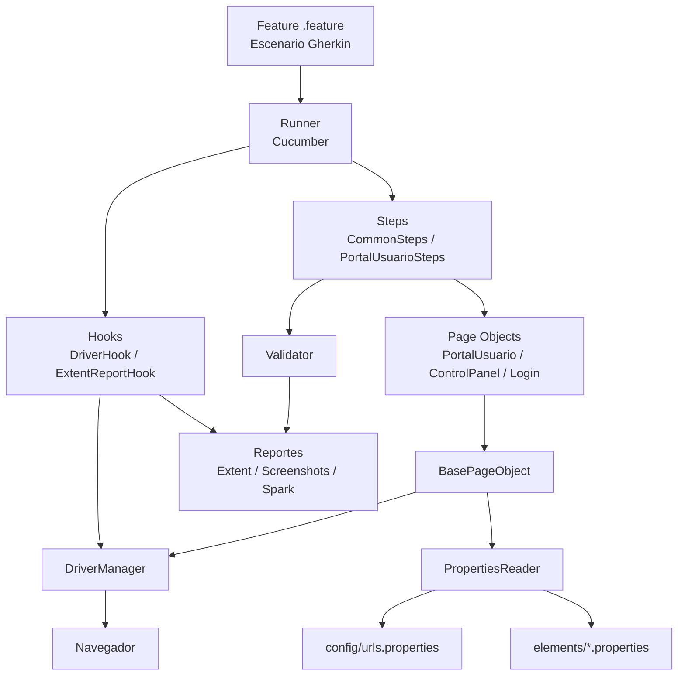

# Arquitectura del framework de automatización

## Flujo de ejecución

```mermaid
flowchart TD
    Feature["Feature .feature<br/>Escenario Gherkin"]
    Runner["Runner<br/>Cucumber"]
    Hooks["Hooks<br/>DriverHook / ExtentReportHook"]
    Steps["Steps<br/>CommonSteps / PortalUsuarioSteps"]
    Pages["Page Objects<br/>PortalUsuario / ControlPanel / Login"]
    Base["BasePageObject"]
    Driver["DriverManager"]
    Browser["Navegador"]
    Validator["Validator"]
    Props["PropertiesReader"]
    Urls["config/urls.properties"]
    Elements["elements/*.properties"]
    Reports["Reportes<br/>Extent / Screenshots / Spark"]

    Feature --> Runner
    Runner --> Hooks
    Runner --> Steps

    Hooks --> Driver
    Hooks --> Reports

    Steps --> Pages
    Steps --> Validator

    Pages --> Base
    Base --> Driver
    Base --> Props

    Props --> Urls
    Props --> Elements

    Driver --> Browser

    Validator --> Reports
```